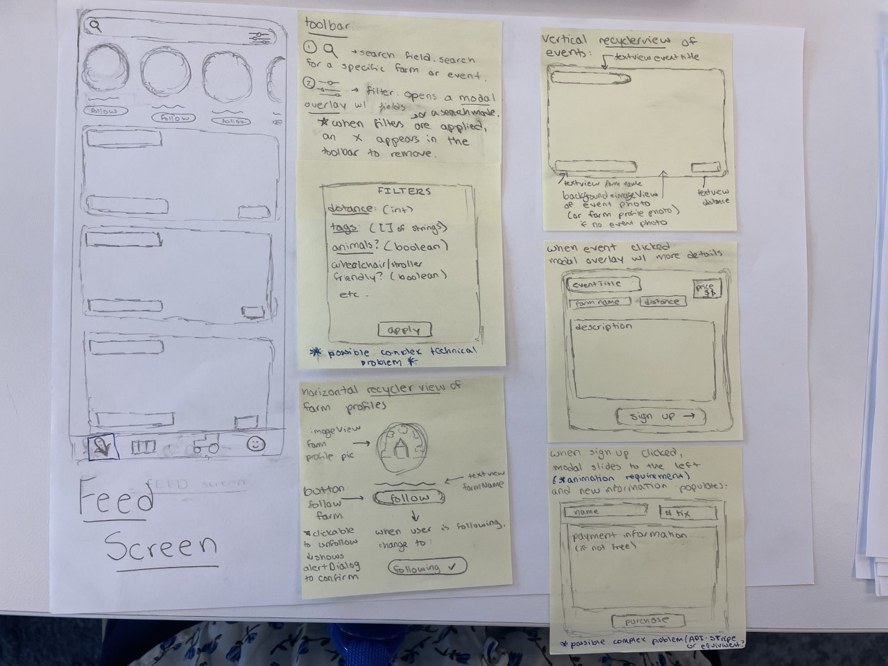
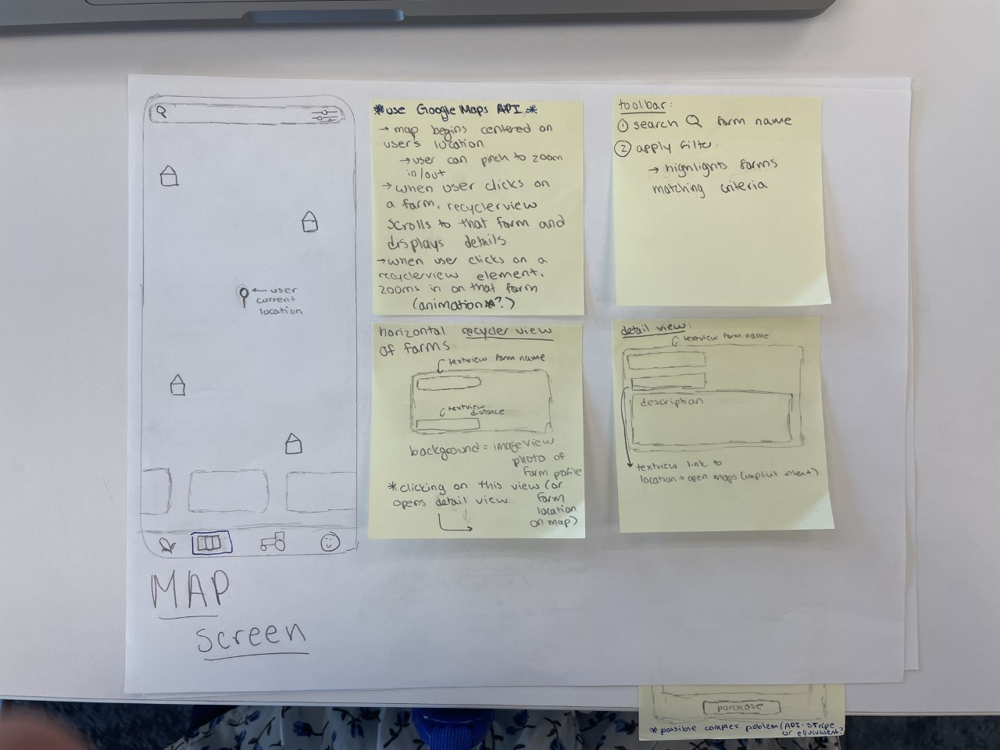
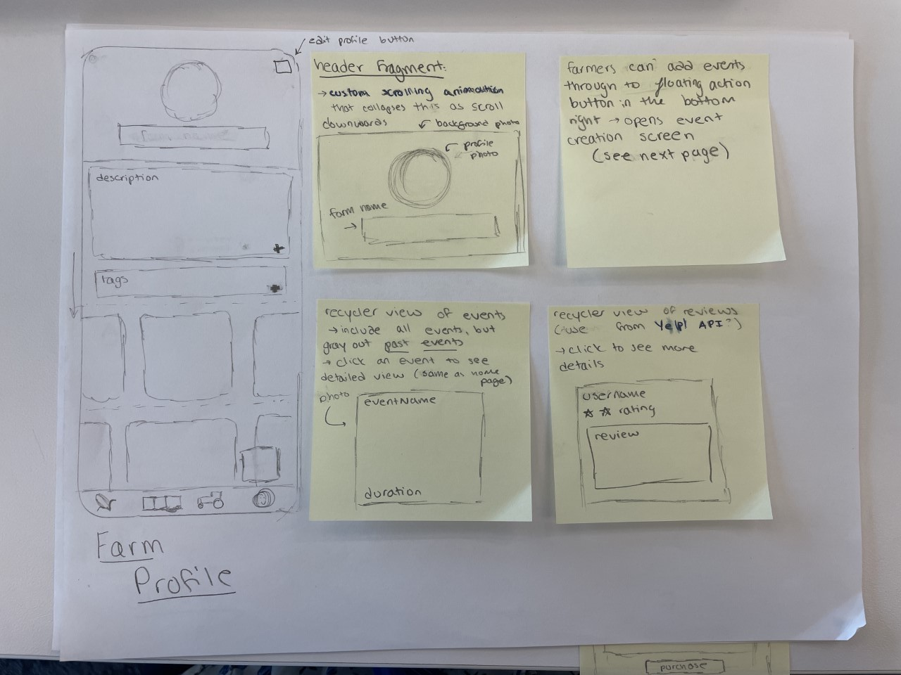
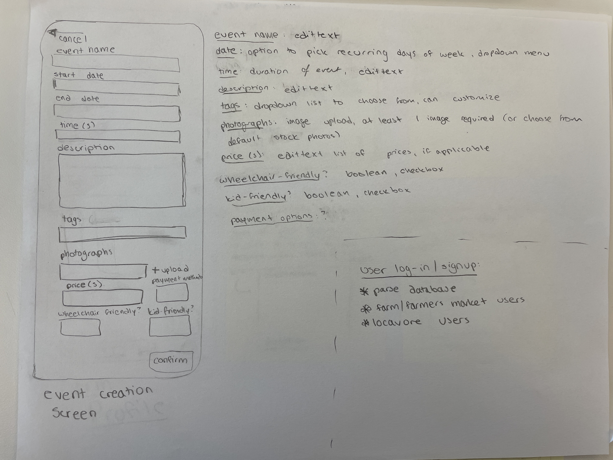
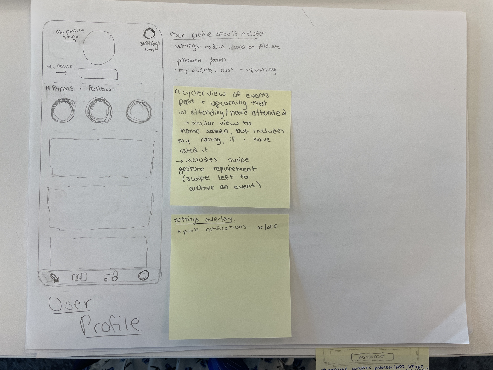

# Locavore

## Table of Contents
1. [Overview](#Overview)
1. [Product Spec](#Product-Spec)
1. [Wireframes](#Wireframes)
2. [Schema](#Schema)

## Overview
### Description
Locavore is an app that helps users find local farms and agritourism events. 

### App Evaluation
[Evaluation of your app across the following attributes]
- **Category:** Social
- **Mobile:** To me, this app would work best on mobile rather than web because of the value of push notifications and the many different audiences who can be reached. 
- **Story:** allow people to find local farms and have on farm experiences. 
- **Market:** many available markets: the definition of agritourism events is very broad, and can be anything from horseback riding lessons to wine tastings at vineyards to corn mazes to sunflower festivals to pick-your-own to concerts/performances. These events all attract a wide variety of people, from young couples to families to the elderly to gen z and millenials. Farms of all shapes and sizes create their own unique charm, and have the capability of capturing the attention of a diverse array of audiences. This is an untapped market because farms mostly operate on word of mouth and thus unless well acquainted with an area, it can be hard for consumers to even know that agritourism events like these are taking place.
- **Habit:** Users can always find new farms and events near them. They can also receive push notifications for events from liked farms, upcoming events they're attending, etc, to keep them engaged. Additionally, events can be added to their calendars.
- **Scope:** All communities can benefit from an app like this: city folk can find events in the nearby countryside, and those who own the farms and live in those communities will benefit from the tourism and spending. 

## Product Spec

### Satisfying Project Requirements:

**Your app provides multiple opportunities for you to overcome difficult/ambiguous technical problems:**
* sorting algorithm for events.
* optimization of database & network requests.

**Your app interacts with a database (e.g. Parse)**
* Parse database

**Your app integrates with at least one SDK (e.g. Google Maps SDK, Facebook SDK) or API (that you didn’t learn about in CodePath) – free SDKs and APIs only**
* Google Maps
* Yelp!
* Google Calendar

**You can log in/log out of your app as a user**
* Using Parse database

**You can sign up with a new user profile**
* Using Parse database

**Your app has multiple views**
* Many views.

**Your app uses at least one gesture (e.g. double tap to like, e.g. pinch to scale)**
* User swipe left to archive event on profile (animates the view leaving the screen)

**Your app incorporates at least one external library to add visual polish**
* Glide, Lottie

**Your app uses at least one animation (e.g. fade in/out, e.g. animating a view growing and shrinking)**
* Fancy scrolling animation within profile
* within map screen, scrolling of the recyclerview depending on farm clicked on (and details view expanding/collapsing as well)

### 1. User Stories (Required and Optional)

**Required Must-have Stories**

* use parse database for:
     * signup / login for farmers (includes farmers markets)
     * signup / login for "locavores"... settings include: setting radius (for searches)?
* home page including: 
    * farmer profile scroll view (horizontal recycler view) at the top
    * deals/sales/upcoming events from local farms (vertical recycler view)
    * user can click on event to see detail view on modal overlay
    * search bar where user can search local farms / filter tags
* events that the user signs up for can be added to their google calendar 
* map where locavores can see farms in their area (use google maps API)
    * horizontal recycler view of farm profiles at the bottom
    * this scrolls to a farm and displays larger details view when a farm is clicked on the map
    * in the opposite direction, as the recycler view is scrolled through, zooms to different farms on the map
    * users can tap to be brought to the farm profile
* farm profile
   * header fragment including profile picture, background picture, name, description, tags. 
   * header fragment collapses with cool scrolling animation as the user scrolls down
   * farmer has edit buttons for this ^
   * horizontal recyclerview of events
   * horizontal recyclerview of reviews (from Yelp! API)
   * floating action button in the bottom right corner in farmer view, to add events
   * event creation screen --> if farmers' market rather than farm then some fields are different
* user profile 
   * profile photo, name, settings, vertical recycler view of events (past + upcoming) that I've attended / will be attending
   * user can swipe left to archive an event
   * logout button
* farms are "favoritable (or followable?)" by user
* push notifications with events from favorited(followed) farms (or just events that user "may like"?)

**Optional Nice-to-have Stories**
*  favorited farms events show up at the top of user's home feed
*  user can post reviews on farm profile
*  user can place an order to the farmer based on current crops in stock via an orders screen
*  user can view a "learn" tab in which various agriculture definitions can be found
*  chat feature where user can ask the farm qs

### 2. Screen Archetypes

* signup/login screen
   * two paths: locavore and farmer/farmers' market
* "feed" screen
   * home page stories
* map screen
    * map stories
* farm profile screen
* user profile screen

### 3. Navigation

**Tab Navigation** (Tab to Screen)

* Home Tab (home screen)
* Map tab (map screen)
* Orders Tab (orders screen--> woud look different for farmer vs consumer)
* User Profile Tab (profile screen--> looks different for farmer vs consumer)

**Flow Navigation** (Screen to Screen)

* Farmer Signup / login
   * signup: set up profile
   * home screen
* Consumer Signup / login
   * signup: set up profile
   * home screen

## Wireframes

### [BONUS] Digital Wireframes & Mockups

### [BONUS] Interactive Prototype

## Schema 

### Models
Farmer User
| Property        | Type                                | Description                             |
|-----------------|-------------------------------------|-----------------------------------------|
| email           | String                              | Email address associated with the farm  |
| password        | String                              | Password for logging in                 |
| farmName        | String                              | Farm Name                               |
| location        | String                              | Farm Address                            |
| profilePhoto    | File                                | Profile picture                         |
| profileBackdrop | File                                | Background photo for profile header     |
| bio             | String                              | Brief description / bio of farm         |
| events          | Array of pointers to Event objects  | Events that this farm has posted        |
| reviews         | Array of pointers to Review objects | Reviews that this farm has received     |
| tags            | Array of Strings                    | Tags that are associated with this farm |
| farmersMarket?  | Boolean                             | True/false if this is a farmers' market |

Locavore User

| Property                 | Type                                   | Description                                                                       |
|--------------------------|----------------------------------------|-----------------------------------------------------------------------------------|
| email                    | String                                 | user email                                                                        |
| password                 | String                                 | user account password                                                             |
| profilePhoto             | File                                   | user profile picture                                                              |
| name                     | String                                 | user's first/last name                                                            |
| farmsFavorited           | Array of pointers to Farm User Objects | farms that this user has favorited                                                |
| events                   | Array of pointers to Event Objects     | events that this user has attended/will attend                                    |
| pushNotificationsEnabled | Boolean                                | whether the user can receive push notifications or not                            |
| radius                   | Integer                                | Radius in miles in which user considers farms within driving distance (aka local) |

Event 

| Property | Type             | Description                     |
|----------|------------------|---------------------------------|
| name     | String           | Name of the event               |
| farm     | Pointer to User  | Name of the farm                |
| tags     | Array of Strings | Tags associated with this event |
| location | String           | Location of this event          |
|          |                  |                                 |
|          |                  |                                 |
|          |                  |                                 |
|          |                  |                                 |
|          |                  |                                 |
|          |                  |                                 |
|          |                  |                                 |

Review -- Waiting on approval from Yelp devs to view the endpoints and json objects
| Property | Type | Description |
|----------|------|-------------|
|          |      |             |
|          |      |             |
|          |      |             |
|          |      |             |
|          |      |             |
|          |      |             |
|          |      |             |
|          |      |             |
|          |      |             |
|          |      |             |
|          |      |             |

Example query:
    
    protected void queryEvents() {
        
    ParseQuery<Event> query = ParseQuery.getQuery(Event.class);    
    query.include(Event.KEY_FARM);     
    query.setLimit(20);
    query.addDescendingOrder("distance");
        
    query.findInBackground(new FindCallback<Event>() {
            @Override
            public void done(List<Event> events, ParseException e) {
                if (e != null)
                {
                    Log.e(TAG, "Issue with getting events", e);
                }
                else
                {
                    for (Event event : events)
                    {
                        Log.i(TAG, "Event: " + event.getDescription() + ", farm: " + post.getFarm().getName());
                    }
                    allEvents.addAll(events);
                    adapter.notifyDataSetChanged(); // modify to make more accurate
                }
            }
        });
    }
    
### Networking
## Requests by Screen
- Home Screen
    - (Read/GET) Query all events within range
    - (Read/GET) Query all farmer profiles within range
- Profile Screen
    - (Read/GET) Query this user's information
    - 
- Map Screen
    - Google Maps API: https://developers.google.com/maps/documentation/android-sdk/utility
    - (READ/GET) Query all farmer profiles within range
- 

- Yelp API: https://knowledge.yelp.com/
- Google Maps API: https://developers.google.com/maps/documentation/android-sdk/utility
- USDA Farmers' Market API: https://search.ams.usda.gov/farmersmarkets/v1/svcdesc.html
- Parse Database: https://www.back4app.com/
- Google Calendar API: https://developers.google.com/calendar/api
